# Chronicle

**A living HTML companion for AI coding sessions.**

Chronicle watches your Claude Code (or Codex) transcripts and renders your project's evolution as a real-time, LLM-authored dashboard — a clean, interactive HTML artifact you can read live, share as a single file, or keep open on a second monitor.

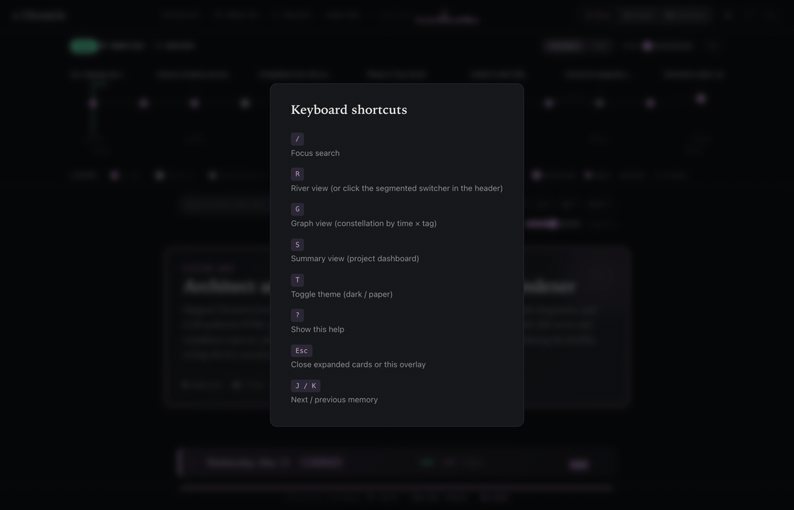

> The screenshots and demo above were captured from Chronicle observing **its own development session** — every memory you see is a real turn from building this tool.

**Get going in ~10 minutes** → jump to [First-time setup](#first-time-setup).

---

## Why

When you code with an AI agent, the artifacts that get saved are the *code* and a flat scroll of *chat history*. The actual *story* of how you got from prompt to working feature — the pivots, the false starts, the milestones — vanishes the moment the session ends.

Chronicle keeps that story. It turns each turn of your session into a structured memory record, weaves narrative bridges between them, draws you a constellation graph of how concepts evolved, and shows you the live cost in tokens & dollars as it works — so you trust it isn't eating your budget.

It's one self-contained HTML file. No build step. No framework lock-in. Works offline.

---

## First-time setup

**Total time: ~10 minutes from "never heard of it" to a shareable HTML.**

### 1 · Prerequisites (one-time)

Two things need to be installed:

**a. Node.js 20 or higher** — the runtime Chronicle is built on.

| Platform | Command |
|---|---|
| macOS (Homebrew) | `brew install node` |
| macOS / Linux (any) | `curl -fsSL https://fnm.vercel.app/install \| bash && fnm install --lts` |
| Windows | Download the LTS installer from <https://nodejs.org/> |

Verify: `node --version` should print `v20.x.x` or higher.

**b. An LLM connection** — Chronicle calls Anthropic during distillation. Pick one:

| Option | How |
|---|---|
| **Reuse Claude Code's auth** *(preferred)* | If you already use Claude Code, you're done — Chronicle reuses your existing `claude` CLI login. |
| **Install `claude` CLI fresh** | `npm install -g @anthropic-ai/claude-code` then `claude /login` (opens a browser OAuth flow). |
| **API key only** | `export ANTHROPIC_API_KEY=sk-ant-…` in your shell (no Claude Code required). |

### 2 · Install Chronicle

> Currently the only install path is from GitHub. After `npm publish` lands, `npx chronicle-cli` will work without any clone — until then, this is the path.

```bash
git clone https://github.com/Thewhey-Brian/chronicle.git
cd chronicle
npm install         # only puppeteer (used for screenshot regeneration); Chronicle itself has zero runtime deps
npm link            # makes the `chronicle` command available globally
```

Verify: `chronicle help` should print the command list.

### 3 · Run Chronicle on your own project

Open a terminal in *your* project — the one where you've been using Claude Code:

```bash
cd ~/projects/your-project/

chronicle init        # installs the Stop hook and writes default config
chronicle index       # parses existing transcripts ($0 — no LLM)
chronicle distill -v  # distills each turn into a memory record (~$0.001/turn)
chronicle narrate     # optional — Sonnet writes narrative chapters (~$0.02)
chronicle wrap        # optional — Opus writes a session hero card (~$0.10)
chronicle serve       # opens http://127.0.0.1:7890 in your browser
```

The dashboard is now live. Memories, git tree, color legend, summary, cost ledger — all visible.

> **From the next Claude Code turn onward, distillation runs automatically in the background via the Stop hook.** The HTML updates live over SSE. You never have to run anything again unless you want a wrap card or a fresh export.

### 4 · Share the result

```bash
chronicle export      # writes ./chronicle.html (~300 KB)
```

That single file is **everything**: code, data, narrative, wrap card — all inlined. Works offline. Open in any browser by double-clicking. Email it, drop it in Slack, commit it to the repo, attach to a PR description, post to a static host — zero dependencies on the receiving end.

### Troubleshooting

| Problem | Fix |
|---|---|
| `No transcripts found` | You haven't run a Claude Code session in this directory yet. Have at least one session, then re-run `chronicle index`. |
| `Not logged in · Please run /login` | Either run `claude /login`, or `export ANTHROPIC_API_KEY=…`. Chronicle auto-falls-back to the env var. |
| Distill produces "Brief exchange" titles | The turn had no tool calls and the prompt was <60 chars — Chronicle skipped the LLM. Run a real coding turn and rerun. |
| Hook keeps firing while you're away | `chronicle uninstall` removes the Stop hook. `init` re-adds it later. |
| Cost seems high | Check `chronicle usage`. The hard cap is `max_per_session_usd` in `.chronicle/config.json` (default `$0.50`). |

---

## What you get

### Three switchable views

A segmented switcher in the header flips between them.

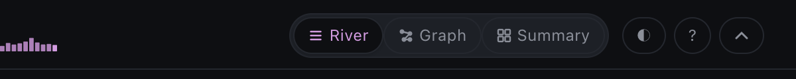

**River** — vertical scroll of memory cards, newest at top. Each card shows the prompt's intent, the impact, a GitHub-style diff, tag chips, and a tiny PROMPT → TOOLS → FILES → IMPACT flow diagram.

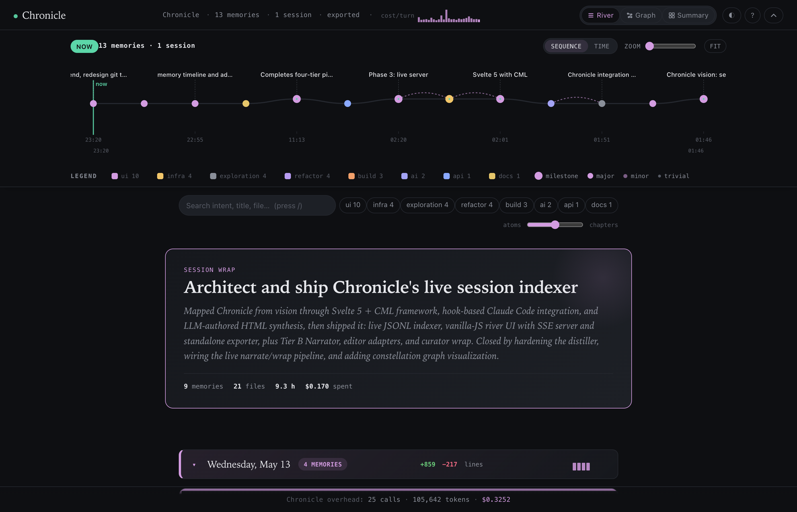

**Graph** — constellation view: time on the y-axis, tag-cluster bands on the x-axis, chronological flow arrows, edges between memories that share files. Side panel surfaces the milestone flow and at-a-glance counts.

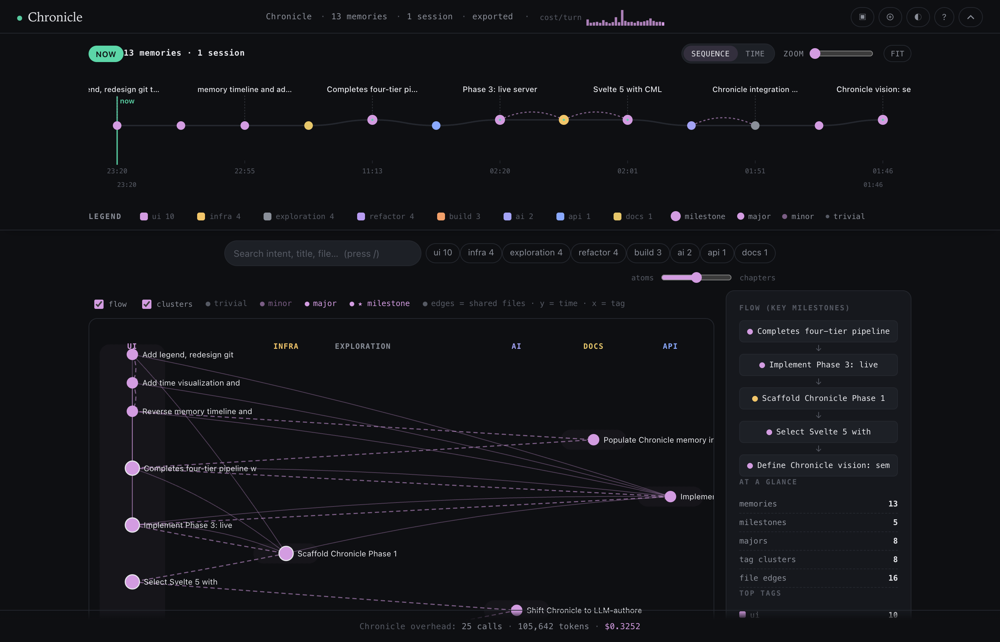

**Summary** — full project dashboard: hero card with session title and vibe tags, count-up stat grid, tag-distribution donut, hour-of-day heatmap, top-touched files, cost-by-tier bars, keyword cloud, full-session timeline ribbon, and a tag-transition Sankey. Click any chart element to drill into a filtered river.

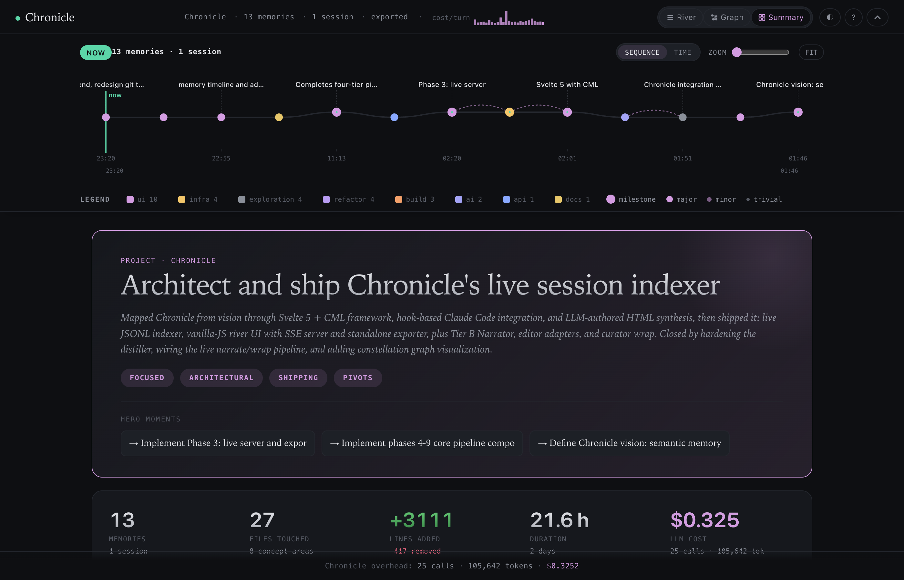
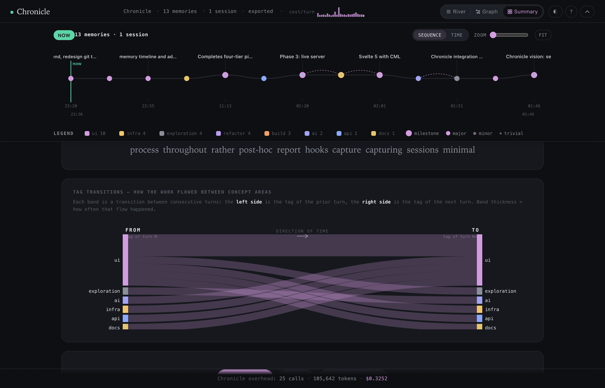

### Specific features

**Sticky horizontal git tree** with keyword labels above major moments, sequence/time mode toggle, zoom slider, and an inline color legend.

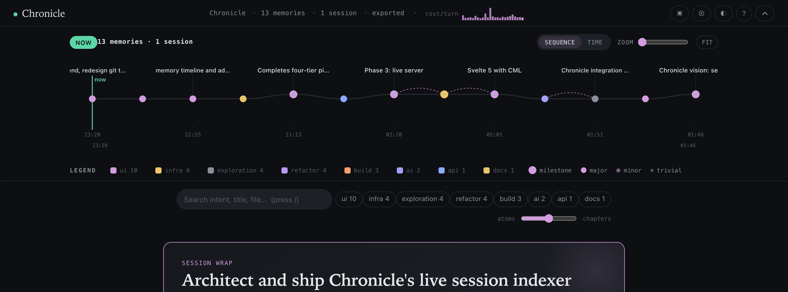

**Tag color legend** — every active tag with its color swatch, count, and click-to-filter behavior.

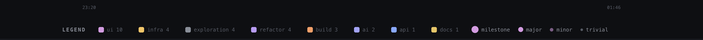

**Sticky day banners** with disclosure caret, per-day color-coded sparkline, and per-day `+lines −lines` summary stats.

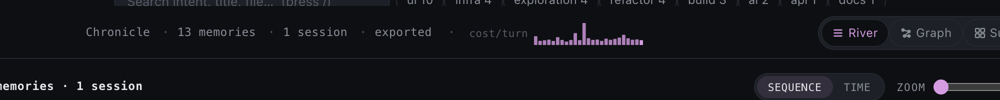

**GitHub-style diff** inline in every memory card, with lightweight syntax highlighting (JS/TS/Python/JSON/CSS/shell).

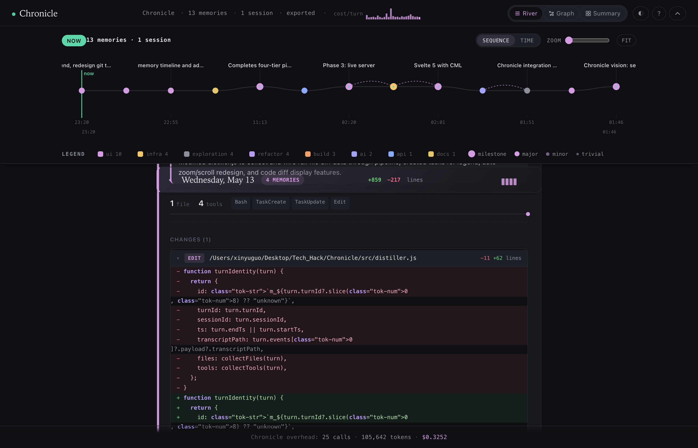

**Compact mode** — one toggle collapses both the header and the git tree into a slim sticky strip so the river can breathe.

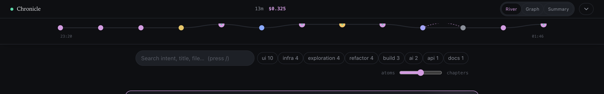

**Paper theme** — warm off-white variant for screenshots, blog posts, or your eyes after dark.

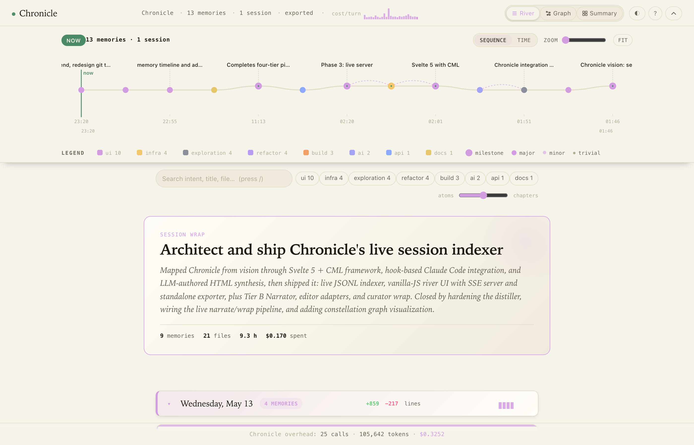

**Live cost ledger** — every LLM call Chronicle makes is logged. Heartbeat sparkline + summary "cost by tier" card show exactly where the budget went.

**Keyboard help overlay** (`?`) — every shortcut at a glance.

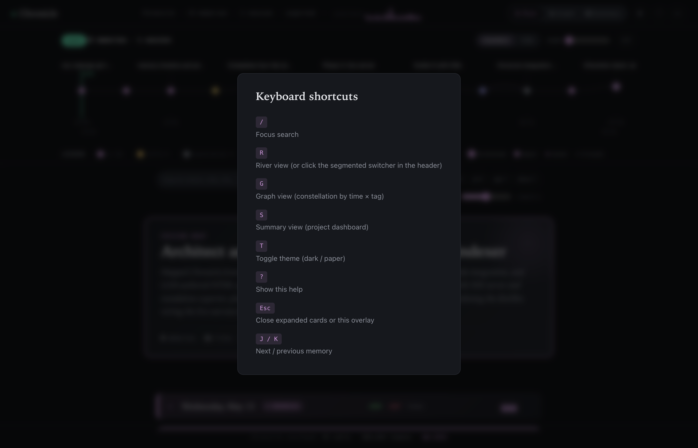

---

## Architecture

Chronicle is a four-tier pipeline. Each tier is more expensive than the previous and runs less often.

| Tier | Trigger | Model | Cost / call | What it does |
|---|---|---|---|---|
| **Capture** | Per turn (free) | — | $0 | Parses transcripts → `.chronicle/index.jsonl` |
| **A — Indexer** | Per turn (Stop hook) | Haiku 4.5 | ~$0.001–0.01 | One memory record per turn |
| **B — Narrator** | Every ~10 memories | Sonnet 4.6 | ~$0.015 | CML narrative bridges between memories |
| **C — Curator** | On `chronicle wrap` | Opus 4.7 | ~$0.10 | Session hero card |

```
~/.claude/projects/<hash>/*.jsonl        ← Claude Code transcripts (read-only)
        ↓ adapter
.chronicle/index.jsonl                   ← raw turn pointers, no LLM
        ↓ Tier A
.chronicle/memories.jsonl                ← one record per turn, ~300 tokens
        ↓ Tier B
.chronicle/narrative/*.cml               ← LLM-authored CML, browser compiles
        ↓ Tier C
.chronicle/wrap.json                     ← session hero card
        ↓
chronicle.html                           ← single-file artifact
.chronicle/usage.jsonl                   ← live cost ledger
```

Typical 50-turn coding session: total Chronicle overhead is around **$0.15–0.50** depending on whether you run Tier B/C. The cost is visible in the UI at all times.

---

## Why a custom markup language (CML)?

Tier B's LLM doesn't write raw HTML. It writes Chronicle Markup Language — a strict tag set the browser compiles to styled HTML.

```xml
<chapter title="Authentication Refactor" span="m_001..m_012">
  <narrative before="m_003">After the cookie approach hit the load test wall,
  the focus shifted to server-side session storage.</narrative>
  <pivot from="m_002" to="m_004">JWT abandoned; Redis chosen for TTL control.</pivot>
  <milestone at="m_007">First green production deploy</milestone>
  <callout kind="risk" at="m_010">Sessions don't replicate cross-region yet.</callout>
</chapter>
```

This separates *what the LLM says* from *how it looks*. The LLM never touches CSS. Stored content survives framework swaps — only the compiler changes.

---

## Commands

```
chronicle init             Install hook + write config
chronicle uninstall        Remove the hook
chronicle status           Project state summary
chronicle adapters         List available coding-agent adapters

chronicle index            Build index from transcripts (no LLM)
chronicle distill [-v]     Tier A: distill turns into memory records
  --turn-latest              Only the most recent turn (hook mode)
chronicle narrate          Tier B: CML narrative chapters
  --chunk <n>                Memories per chapter (default 8)
chronicle wrap             Tier C: session wrap card
  --session <id>             Specific session (default: latest)

chronicle serve            Live HTML at http://127.0.0.1:7890
  --port <n>                 Default 7890
  --no-open                  Skip auto-opening browser
chronicle export           Standalone chronicle.html (data inlined)
  --out <path>               Default ./chronicle.html

chronicle show             One-line summary of each turn
chronicle memories         List all distilled memories
chronicle usage            Cumulative token / cost ledger
```

---

## Privacy & cost

- **All data stays local.** `.chronicle/` lives in your project; transcripts never leave your machine.
- Chronicle's LLM calls go to Anthropic via the same auth your editor already uses. If `claude` is on PATH, OAuth is reused; otherwise `ANTHROPIC_API_KEY` is used.
- A redaction pre-pass removes obvious secrets (`.env`, key shapes) before any LLM call.
- The cost ledger is appended to `.chronicle/usage.jsonl` on every call, surfaced live in the HTML, and capped per-turn and per-session in config.

---

## Adapters

Each coding agent plugs in via `src/adapters/`. Current state:

- `claude-code` — reference implementation, fully working
- `codex` — detects installation; full parser is a stub (falls back to generic)
- `generic` — git-based fallback, works for any editor (lower fidelity — no prompts captured)

Auto-detection picks the first adapter that finds transcripts for the current project.

---

## Keyboard shortcuts

```
/           Focus search
R / G / S   River · Graph · Summary views
T           Toggle theme (dark / paper)
?           Help overlay
J / K       Next / previous memory
Esc         Close overlays / collapse cards
```

---

## Project status

Early. The pipeline works end-to-end on Claude Code. The HTML dashboard is genuinely usable. Codex transcript parsing, embedding-based search, and a few visual polish items are explicit next steps.

Built with the help of the very tool it produces. The `chronicle.html` of building Chronicle is the demo.

## Contributing

Issues and PRs welcome. The codebase is intentionally small (~3K lines), framework-free on the frontend, and easy to fork. Start at `bin/chronicle.js` for the CLI shape and `web/chronicle.html` for the dashboard.

### Regenerating the README screenshots & demo

```bash
npm install                       # gets puppeteer (dev only)
node bin/chronicle.js export      # refresh chronicle.html with current data
node scripts/capture.js           # runs headless Chrome + ffmpeg → assets/screenshots/
```

The capture script cycles through River → expanded-diff → Graph → Summary, snaps PNGs at 2× density, and assembles a 6 fps GIF via ffmpeg's palette-aware pipeline.

## License

MIT
